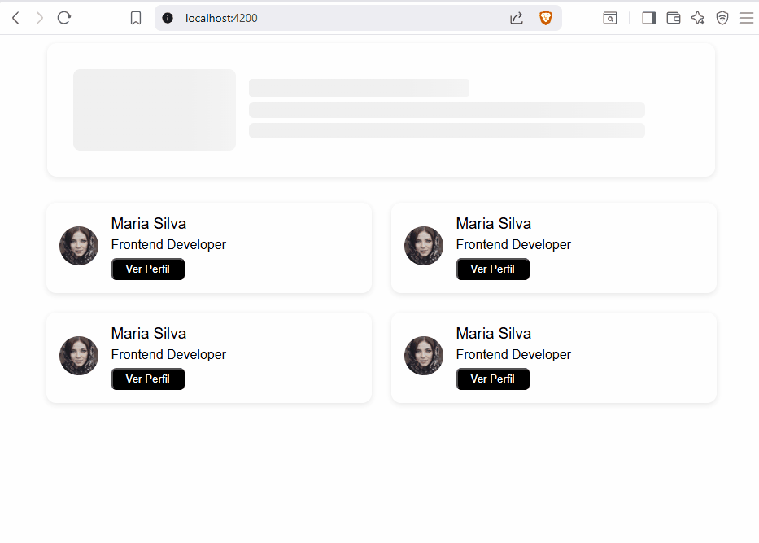

# 🎨 Skeleton no Angular

Este projeto documenta minha jornada de especialização em UI Engineering, focada na criação de componentes de carregamento (Skeletons) que não apenas ocupam espaço, mas comunicam a hierarquia visual e respeitam regras de negócio complexas.

## 🎯 Objetivo do Projeto
O foco aqui foi transitar de Skeletons estáticos para um Motor de Renderização Dinâmico, capaz de adaptar seu layout (Grid) conforme a quantidade de dados e o dispositivo do usuário, garantindo uma experiência de usuário (UX) amigável e carregamento com performance.

## 🧬 Fase 1: Fundamentos e Consumo de API
Nesta etapa inicial, o desafio foi criar a base visual e integrar o componente com dados reais.

**O que foi aplicado:** Criação de formas circulares e retangulares.

**Integração:** Consumo de uma API de usuários para substituir o Skeleton pela foto e dados reais.

**Aprendizado:** Entender como o estado de "loading" impacta a percepção de velocidade do app.

#### Exemplo Skeleton 1




## 🧠 Fase 2: Engenharia de Layout
Aqui o projeto evoluiu para atender às regras de negócio. O desafio era um card de ofertas com até 5 blocos de informação, onde a ordem e a altura do card eram cruciais.

  ### 🛠️ O Poder do SCSS Avançado (Mixins & Loops)
  Para evitar a repetição de código (Princípio DRY), desenvolvi um Mixin Inteligente.

**Loop @for:** Automatiza a criação de regras para 2, 3, 4 ou 5 boxes.

**Cálculos Matemáticos:** O SCSS calcula sozinho a largura das colunas (ex: calc(35% / n)).

**Interpolação:** Uso de #{$variavel} para injetar lógica dinâmica direto nas propriedades CSS.

  ### 📱 Responsividade Estratégica
  Diferente de um flex-direction: column comum, aplicamos uma reorganização inteligente no Tablet (1024px):

Box 2 (Animated): Desce para a base para o card não ficar muito alto.

Box 1 (Score) e Boxes 3, 4, 5 (Infos): Sobem para o topo, dividindo a largura igualmente.

Seletor :has(): O CSS detecta sozinho quantos filhos o HTML tem e aplica o layout correto.


#### Exemplo Skeleton 2


## 🍎 Frutos Colhidos e Aprendizados
Este projeto consolidou conhecimentos fundamentais para qualquer desenvolvedor Frontend Senior:

✅ Pensamento de Engenharia: CSS não é apenas "cor e brilho", é lógica de posicionamento e matemática.

✅ Componentes Reutilizáveis: O engine aceita qualquer número de boxes e se vira sozinho para organizar o espaço.

✅ Alinhamento com Produto: A capacidade de traduzir uma necessidade de negócio (ex: "quero o card menos alto no tablet") em código técnico escalável.

✅ Angular 18 & OnPush: Garantia de que o componente só re-renderiza quando os dados realmente mudam.


## 🚀 Como rodar o projeto
1. Clone o repositório.

2. Navegue para dentro do diretório.

3. Rode o json-server configurado com 
```bash 
npm run start:json
```

4. Instale as dependências com  
```bash 
npm install 
```

5. Execute ng serve para ver a mágica acontecer em localhost:4200.

6. Para testes E2E execute 
```bash 
npm run run:cypress 
```

## 🤝 Contribuição e Feedback

Este projeto é um estudo contínuo sobre **Sass Avançado** e **Arquitetura de Componentes no Angular 18**. Se você deseja contribuir, sinta-se à vontade para abrir uma *Issue* ou enviar um *Pull Request*, focando exclusivamente nos seguintes tópicos:

* **Otimização de SCSS:** Melhorias em Mixins, funções e lógica de Grid.
* **Arquitetura de Componentes:** Refatoração para maior escalabilidade e performance (Signals, OnPush).
* **Novos Skeletons:** Criação de novos padrões de carregamento responsivo.

---

### ⭐ Apoie este projeto
Se este "Skeleton" foi útil para você ou serviu de inspiração para os seus estudos, por favor, **considere deixar uma estrela (Star) neste repositório**. 

Esse pequeno gesto ajuda muito a aumentar a visibilidade do projeto e me motiva a continuar documentando e compartilhando meus aprendizados com a comunidade!
